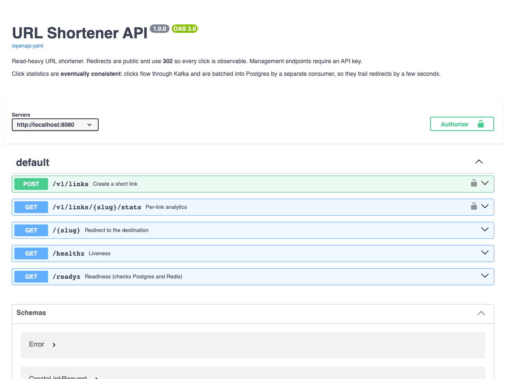
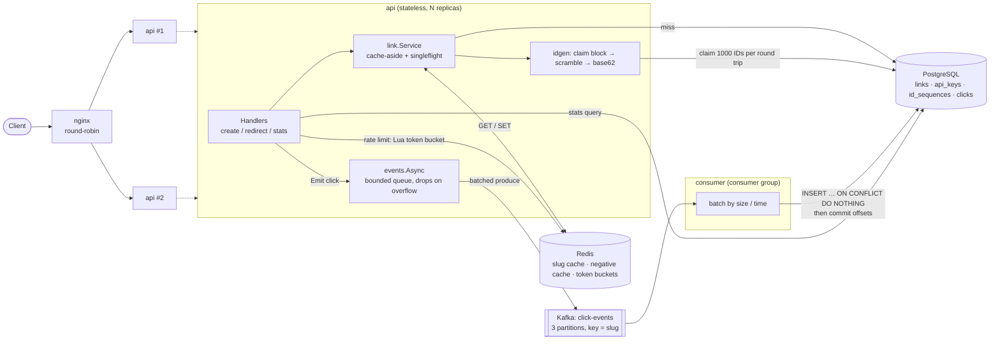

# Distributed URL Shortener

A read-optimized URL shortener in Go, built to demonstrate distributed-systems
design: stateless horizontally-scaled API, cache-aside reads, range-allocated
IDs, and an asynchronous, idempotent analytics pipeline over Kafka (or SQS).

Redirects outnumber writes ~100:1, so every decision below favors the redirect path.

```
Client → nginx → api ×2 ──► Redis (cache, rate limit)
                   │  └───► Postgres (source of truth, ID blocks)
                   └─async─► Kafka ─► consumer ─► Postgres (clicks)
```

Diagram and package map: [docs/ARCHITECTURE.md](docs/ARCHITECTURE.md).

## API docs

Interactive Swagger UI served at `/docs` (rendered from `api/openapi.yaml`).



## Architecture



More detail: [docs/ARCHITECTURE.md](docs/ARCHITECTURE.md)


## What's here

| Layer | Where | Verified how |
|---|---|---|
| Core service (API, consumer, Postgres, Redis, Kafka) | `cmd/`, `internal/`, `docker-compose.yml` | unit + integration tests, `scripts/smoke.sh` |
| Observability (Prometheus, Grafana, alert rules) | `internal/metrics`, `deploy/prometheus`, `deploy/grafana` | live scrape of all targets, dashboard provisioned |
| Load testing (k6, 100:1 mix) | `loadtest/`, [docs/LOADTEST.md](docs/LOADTEST.md) | run locally; numbers and caveats recorded |
| SQS backend (`EVENT_BACKEND=sqs`) | `internal/events/sqs`, `internal/consumer/sqs.go`, `docker-compose.sqs.yml` | unit tests + full smoke test on ElasticMQ |
| Kubernetes on kind | `deploy/k8s/` | deployed, smoke-tested, rolling restart under traffic |
| CI/CD (GitHub Actions) | `.github/workflows/` | runs on every push (see Actions tab); actionlint-clean |
| AWS via Terraform (ECS Fargate, RDS, ElastiCache, SQS, ALB) | `infra/terraform/` | `fmt`, `validate`, Trivy; **not applied to a real account** |

## Quick start

Requires Docker (and Go 1.27+ only if you want to run tests locally).

```bash
docker compose up --build -d     # postgres, redis, kafka, migrations, 2× api, consumer, nginx
./scripts/smoke.sh               # end-to-end check (create, redirect, stats, rate limit)
```

- API: http://localhost:8080 · Docs (Swagger UI): http://localhost:8080/docs
- Demo API key: `dev-key-change-me` (set `SEED_API_KEY` to change it)

```bash
curl -X POST localhost:8080/v1/links -H 'X-API-Key: dev-key-change-me' \
  -H 'Content-Type: application/json' \
  -d '{"url":"https://example.com/very/long/path","alias":"hello","expires_at":"2030-01-01T00:00:00Z"}'

curl -i localhost:8080/hello                      # 302 → destination
curl localhost:8080/v1/links/hello/stats -H 'X-API-Key: dev-key-change-me'
```

- Grafana (dashboard "URL Shortener Overview"): http://localhost:3000 (`GRAFANA_PORT` to change) · Prometheus: http://localhost:9090
- `docker compose -f docker-compose.yml -f docker-compose.sqs.yml up --build -d` runs the same stack with **SQS** (ElasticMQ) instead of Kafka
- `make loadtest` generates a 100:1 read-heavy workload with k6 while you watch Grafana
- `make k8s-up` deploys everything to a local **kind** cluster (API on :8081, Grafana on :3300)

Tear down with `docker compose down -v`.

### Tests

```bash
make test               # unit tests, race detector, no infrastructure needed
make test-integration   # + real Postgres and Kafka (see Makefile for the two docker run lines)
```

Unit tests cover code generation (base62, scrambler, allocator), the redirect path
(cache hit/miss/negative/expiry, Redis failure fallback, stampede coalescing, HTTP
status/headers/click emission), the rate limiter, and the consumer's commit-after-write
and redelivery behavior. Integration tests (build tag `integration`) cover concurrent
block claims against real Postgres, idempotent batch inserts, stats queries, and a Kafka round trip.

## Design decisions and rejected alternatives

### 1. Short codes: range allocation → Feistel scramble → base62
Each API instance claims a block of 1000 IDs with one atomic
`UPDATE id_sequences SET next_id = next_id + 1000 … RETURNING`, hands them out from
memory, and refills when empty. Postgres sees one write per 1000 links, and instances
never coordinate otherwise. The ID is then passed through a keyed 4-round Feistel
permutation over 2^40 and base62-encoded: always ≤ 7 characters, collision-free by
construction (it is a bijection), not enumerable by incrementing.

Rejected:
- **`nextval()` / auto-increment per insert**: a sequence round trip per create, and slugs are sequential and guessable.
- **Random strings + collision check**: needs a read-before-write (or retry on conflict) per create; collision odds grow with table size.
- **Hash of the URL (MD5/SHA prefix)**: truncation collisions need resolution logic, and the same URL always maps to one slug (no per-user links, no expiry per link).
- **Snowflake-style IDs**: needs worker-ID assignment (itself a coordination problem) and yields 11+ character slugs.
- **Redis `INCR` as the counter**: adds a durability problem; a Redis flush could re-issue IDs. Postgres is already the source of truth.
- **Dedicated ID service (ZooKeeper/etcd)**: more infrastructure for the same guarantee.

Trade-offs, accepted: an instance that dies mid-block wastes its unused IDs (gaps are
harmless; 2^40 ≈ 1.1 trillion). The scramble is obfuscation, not encryption, and
`SCRAMBLE_SECRET` must be identical on every instance. Custom aliases share the
`links.slug` primary key, and the unique constraint arbitrates against generated slugs
(generation retries on conflict).

### 2. Reads: Redis cache-aside, with negative caching and request coalescing
Redirect = Redis `GET`; on miss, one Postgres read then `SET`. Additional details:
- **Negative caching** (30 s) of unknown/expired slugs, so scanners hitting random slugs don't reach Postgres.
- **`singleflight`**: concurrent misses for one slug share a single DB query (tested: 50 concurrent misses → 1 read), preventing a stampede when a hot entry expires.
- **TTL is capped at the link's expiry**, so a cached redirect can never outlive the link.
- **Redis errors are non-fatal**: the request falls back to Postgres. Redis down degrades latency, not availability.
- Links are immutable in the API, so there is no invalidation problem. Adding update/delete would require explicit invalidation.

Rejected: **write-through** (most links are never read; wastes memory), **in-process caches only** (each of N instances warms separately, cold on deploy; a good L1 to add later), **CDN-cached redirects** (see 302 below).

### 3. 302, not 301
A 301 is cached by browsers and CDNs indefinitely, so repeat clicks would never reach us and
analytics would undercount. `Cache-Control: no-store` is also set. Cost: every click hits our
edge, which is exactly why the redirect path is the hot path to optimize. `HEAD` requests (previews, uptime probes) are not counted as clicks.

### 4. Click events: fire-and-forget into a bounded queue, then Kafka
The handler calls `Emit`, which is a non-blocking channel send. Workers batch (≤100 events
or 5 ms) and publish. If the queue is full, the event is **dropped and counted**, never blocking the redirect.

Verified manually: with Kafka stopped, redirects still returned 302 in 1.6–11 ms.
The cost is also real, and observable: clicks during that outage were lost (the API logged the failed batches and stats stayed at 0).

Rejected:
- **Synchronous publish**: Kafka latency or outage becomes redirect latency or downtime.
- **Write click to Postgres in the request**: turns a 100:1 read workload into a write-heavy one on the source of truth.
- **Redis `INCR` counters**: no per-click detail (referer, time series), and loses data on Redis restart.
- **Transactional outbox**: would give lossless events, but needs a DB write on the redirect path, defeating the goal. Analytics here tolerate small loss.

### 5. Consumer: at-least-once delivery + idempotent writes
Consumer-group member; accumulates a batch (500 events or 2 s), writes it with **one**
`INSERT … SELECT FROM unnest(…) ON CONFLICT (event_id) DO NOTHING`, and **commits Kafka offsets only after the insert succeeds**.
Each click carries a UUID generated at redirect time, so a crash between write and commit just re-delivers events that dedupe to no-ops.
Tested with simulated redelivery (3 deliveries of the same 6 events → 6 rows) and against real Postgres.

- Insert failures are retried with backoff and never skipped: no commit, no data loss, natural backpressure.
- **Poison messages** (undecodable/invalid) are logged and committed past so they can't block a partition. A real deployment would route them to a dead-letter topic.
- Partitions are keyed by slug (per-link ordering; spreads load). Scale by adding consumer instances, up to the partition count (3).

Rejected: **Kafka exactly-once transactions** (don't extend to a non-Kafka sink without an outbox; idempotent sink is simpler and sufficient), **`COPY`** (no `ON CONFLICT`), **row-at-a-time inserts** (round-trip bound), **dedupe in Redis** (extra state that can disagree with the DB).

### 6. Kafka behind an interface, with a working SQS backend
Producer: `events.Publisher` (`Publish(ctx, []Click)`); consumer: `consumer.Source` (`Fetch`/`Commit`) and `consumer.Sink`.
`EVENT_BACKEND=kafka|sqs` selects the implementation in `main`; everything else only sees the interfaces.
The SQS side (`internal/events/sqs`, `internal/consumer/sqs.go`) batches 10 per `SendMessageBatch`, retries rejected
entries once, long-polls `ReceiveMessage`, and treats `DeleteMessageBatch` as "commit". It is verified end to end:
the full smoke test passes with clicks flowing through ElasticMQ (`docker-compose.sqs.yml`), and the API logs contain no Kafka references.

Because the sink is idempotent, a standard SQS queue (at-least-once, unordered) is enough: **no FIFO queue required**.
Differences handled explicitly: SQS has no offsets (delete = commit), a stale receipt handle is a *sender fault* that must not
be retried forever (it would wedge the consumer; the message is redelivered and deduplicated instead), and consumer lag
comes from CloudWatch (`ApproximateAgeOfOldestMessage`) rather than a client-side gauge.

### 7. Rate limiting: Redis token bucket in Lua
Per API key on creation. The whole read-modify-write is one Lua script, atomic across all instances without locks, and
**uses Redis `TIME`** so clock skew between instances can't grant extra tokens. Returns `Retry-After`. Defaults: burst 10, 60/min.
It **fails open** if Redis is unreachable (creation is low-volume and already authenticated; losing writes seemed worse than briefly unlimited writes).

Rejected: **fixed window** (2× burst at window edges), **sliding-window log** (memory per request), **per-instance in-memory limits** (effective limit scales with replica count).

### 8. API keys: SHA-256 hashes in Postgres
Keys are stored hashed, shown once. A fast hash is appropriate because keys are high-entropy random
strings (no dictionary attack to slow down) and auth runs on every create. Rejected: bcrypt/argon2 (needed for passwords, not here), JWT/OAuth (heavier than the requirement; the seam is `auth.Authenticator`). Stats are visible only to the key that created the link, and others receive 404 (not 403) so slugs can't be probed.

### 9. Postgres as source of truth
Slug is the primary key, so the redirect miss path is one index probe. `clicks` has no foreign key to `links` on purpose: a batch insert must never fail because of a deleted or not-yet-visible link, which would wedge the consumer. Rejected: DynamoDB/Cassandra (the access pattern is trivial KV, but Postgres comfortably handles it behind a cache, gives transactions for ID allocation, and keeps local setup to one container).
At larger scale `clicks` should be time-partitioned, or moved to a column store; noted below.

### 10. Smaller choices
- **stdlib `net/http` + Go 1.22 `ServeMux`** (method/path patterns): no framework needed; literal routes beat `/{slug}`.
- **`pgx` without an ORM**: the allocation and batch queries must be explicit SQL.
- **`segmentio/kafka-go`**: pure Go (no cgo), simple to build in a distroless image. `franz-go` is more capable; `confluent-kafka-go` needs cgo.
- **Topics created explicitly (`EnsureTopic`)**: broker auto-creation raced with the first write in testing (found by the integration test) and gives no control over partition count.
- **OpenAPI spec is hand-written** and embedded in the binary. It can drift from handlers; code generation was heavier than warranted.
- **nginx in compose** round-robins across `api` replicas (re-resolving Docker DNS every 5 s) and overwrites `X-Forwarded-For`; the API trusts that header only when `TRUST_PROXY=true`.
- **Logging**: management calls only. Per-redirect logs would cost more than the redirect; redirect behavior is observed through metrics (§11).

### 11. Observability
Prometheus **pull** model, metrics on a **separate port (9100) that is never published** through the load balancer.
Routes are labelled by name (`redirect`, `create`, `stats`), never by raw path, so slug cardinality cannot blow up the TSDB.
Latency buckets are dense in the low milliseconds because a cache-hit redirect should take about one. The key signals:
cache outcome (`hit`/`negative_hit`/`miss`/errors), click queue length and `sent`/`dropped`/`failed` counters (read lazily
from atomics on scrape, so they cost nothing on the redirect path), consumer lag and duplicates, DB pool saturation, ID block claims,
and rate limiter decisions. `deploy/prometheus/alerts.yml` encodes eight alerts (dropped/failed clicks, consumer lag, insert
failures, redirect p99 and 5xx rate, cache hit ratio, instance down). Compose discovers replicas through DNS; Kubernetes
through pod annotations; both load the same alert rules and dashboard JSON.

Rejected: **OpenTelemetry-first** (heavier for a metrics-only need; the observer interfaces would let us add it), **push gateways**,
**per-request logging** (cost on the hot path).

### 12. Kubernetes
Plain kustomize, no Helm: the app is two Deployments and the manifests are easy to read. Notable details: `maxUnavailable: 0` +
readiness on `/readyz` + a native `preStop` sleep (the distroless image has no shell) so rolling updates drain cleanly;
`enableServiceLinks: false` on Kafka (otherwise Kubernetes injects `KAFKA_PORT=tcp://...`, which the Kafka image misreads as
broker config); PodDisruptionBudget; HPA on CPU (metrics-server installed in kind); read-only root filesystem, non-root, all
capabilities dropped; `init` containers wait for the migration Job. The ConfigMaps for migrations, alert rules and dashboards
are generated from the repo's own files, so there is one source of truth across compose and Kubernetes.

Rolling restarts under continuous traffic: 9 of 10 runs showed **0 failed requests** (~100 each). One run, during cluster
warm-up right after metrics-server was installed, saw 2 connection failures in 541 requests; the cause was not captured, and
it did not reproduce. I'd rather report that than claim perfect zero-downtime.

### 13. CI/CD
GitHub Actions: gofmt, `go mod tidy` cleanliness, vet, race tests, `govulncheck`; integration tests against *real* Postgres and
Kafka service containers; a compose end-to-end job (Kafka variant, k6 smoke, then the SQS variant); a kind end-to-end job
(deploy, smoke, rolling restart); and a matrix image build that publishes to GHCR only from `main`. Terraform has its own
path-filtered workflow (fmt, validate, Trivy). Dependabot covers Go modules, Docker and Actions.

The pipeline earned its keep: its first real run caught a test-ordering bug the local runs hid (the rolling-restart check
ran right after the smoke test had drained the rate limiter, and correctly received a 429).

### 14. AWS (Terraform): ECS Fargate, not EKS
Two stateless services and no need for Kubernetes' flexibility, so Fargate removes node management and cost. SQS replaces Kafka
(the interface payoff above), RDS and ElastiCache replace the containers, an ALB replaces nginx. Task roles are least-privilege
and *separate* (the API can only `SendMessage`; the consumer can only receive/delete). Secrets live in Secrets Manager. Redis and
Postgres use TLS (`REDIS_TLS`, `sslmode=require`). A DLQ catches messages that fail 5 times, with an alarm. Migrations run as a
one-off ECS task *before* the services are created. See [infra/terraform/README.md](infra/terraform/README.md) for the
cost estimate and the honest list of what is and is not verified.

Behind an ALB the client IP is the **rightmost** `X-Forwarded-For` entry (the ALB appends; earlier entries are client-forged).
That rule is also correct for the nginx setup, which overwrites the header. (The first version used the leftmost entry, which
is spoofable behind a load balancer that appends; found while designing the AWS deployment.)

## Failure behavior

| Failure | Behavior |
|---|---|
| Redis down | Redirects served from Postgres (slower); rate limiter fails open |
| Kafka down | Redirects unaffected; click events dropped/failed and counted (data loss for that window) |
| Postgres down | Cached redirects still work until TTL; creates, cache misses, stats fail; consumer retries with backoff, commits nothing |
| API instance crash | Unused IDs in its block are skipped; queued, unsent clicks are lost |
| Consumer crash | Uncommitted events re-delivered; idempotent insert prevents double count |

## Known limitations

- Click loss is possible on a bus outage or abrupt API crash (by design, see §4). Observed during an outage test.
- Compose and kind run a single Kafka broker, Postgres and Redis: no replication. The AWS Terraform has Multi-AZ options but defaults to single instances for cost.
- Poison messages are skipped, not dead-lettered (SQS has a DLQ for delivery failures, but undecodable bodies are still skipped by the consumer).
- No link update/delete (would require cache invalidation).
- Swagger UI loads its assets from a CDN, so `/docs` needs internet access.
- `clicks` is a single table; it will need time partitioning at high volume.
- The load-test numbers come from one laptop running everything; see [docs/LOADTEST.md](docs/LOADTEST.md) for what they do and do not show.
- The AWS Terraform has been validated and security-scanned but never applied (no AWS account was used).
- Kubernetes secrets in git are demo values; use a secret manager for anything real.

## Configuration

Environment variables, with defaults suitable for compose (`internal/config`):
`DATABASE_URL`, `REDIS_ADDR`, `KAFKA_BROKERS`, `KAFKA_TOPIC`, `KAFKA_PARTITIONS`, `KAFKA_GROUP`,
`BASE_URL`, `HTTP_ADDR`, `BLOCK_SIZE`, `SCRAMBLE_SECRET`, `CACHE_TTL`, `NEGATIVE_CACHE_TTL`,
`RATE_LIMIT_BURST`, `RATE_LIMIT_PER_MINUTE`, `CONSUMER_BATCH_SIZE`, `CONSUMER_FLUSH_EVERY`,
`SEED_API_KEY`, `TRUST_PROXY`, `METRICS_ADDR`, `EVENT_BACKEND` (`kafka`|`sqs`), `SQS_QUEUE_URL`, `SQS_ENDPOINT`,
`AWS_REGION`, `REDIS_TLS`. Compose-only: `GRAFANA_PORT`, `RATE_LIMIT_*` (overridden by `make loadtest`).
