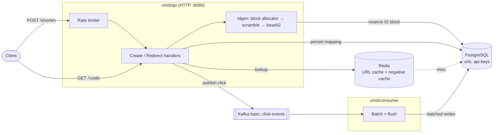

# Architecture

> The repo currently contains the ID-generation package and configuration; the API and consumer entrypoints are stubs. This diagram shows the intended design, as defined by `internal/config` and `internal/idgen`.

| Component | Role |
|---|---|
| `internal/idgen` | Allocates ID blocks (`BLOCK_SIZE`), scrambles with a secret, encodes as base62 |
| `internal/config` | Env-based config (DB, Redis, Kafka, TTLs, rate limits) |
| `cmd/api` | Public HTTP API (stub) |
| `cmd/consumer` | Click-event consumer with batch flushing (stub) |
