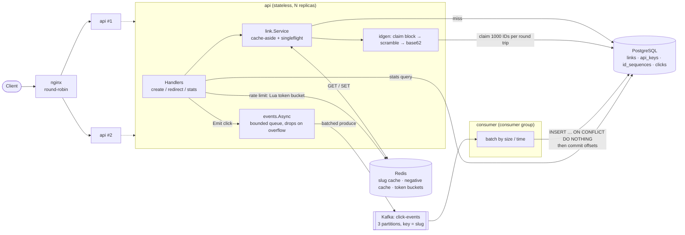

# Architecture

## Request paths

**Redirect `GET /{slug}`**: Redis hit → 302. Miss → one coalesced Postgres read → fill Redis → 302.
The click is handed to an in-memory queue and the response is sent; Kafka is never on the critical path.

**Create `POST /v1/links`**: authenticate (hashed key lookup) → token bucket → validate →
slug from local ID block (or custom alias) → insert into Postgres.

**Analytics**: API → Kafka → consumer → `clicks` table (idempotent on `event_id`) → `GET /v1/links/{slug}/stats`.

| Package | Role |
|---|---|
| `internal/idgen` | Base62, Feistel scrambler, block allocator |
| `internal/link` | Domain model, service (create/resolve), cache interface |
| `internal/cache` | Redis cache-aside implementation |
| `internal/ratelimit` | Redis Lua token bucket |
| `internal/events` | `Publisher` interface, non-blocking `Async` wrapper; `events/kafka` backend |
| `internal/consumer` | `Source`/`Sink` interfaces, batching/commit loop, Kafka source |
| `internal/store/postgres` | Pool, block claiming, repos, batch click insert, stats |
| `internal/httpapi` | Handlers, auth middleware, docs endpoints |
| `api/` | Embedded OpenAPI spec |
